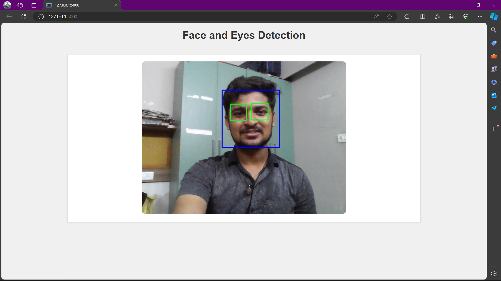

# Face and Eyes detection with Flask and OpenCV

This project implements a simple face and eyes detection application using Flask and OpenCV.

## Overview

The application sets up a Flask server to handle video stream requests and uses OpenCV to capture and process video frames. The live video stream is displayed on a web page and detect face and eyes.

## Preview


## Project Structure

- `app.py`: The main Flask application file that handles video streaming and detect face and eyes
- `templates/index.html`: The HTML template that displays the live video stream.

## Getting Started

1. Clone the repository:
    ```bash
    git clone https://github.com/RiteshYennuwar/Face_and_Eye_Detection.git
    cd Face_and_Eye_Detection
    ```

2. Install the required packages:
    ```bash
    pip install -r requirements.txt
    ```

## Usage

1. Run the Flask application:
    ```bash
    python app.py
    ```

2. Open your web browser and go to http://127.0.0.1:5000 to see the face and eyes detection.
